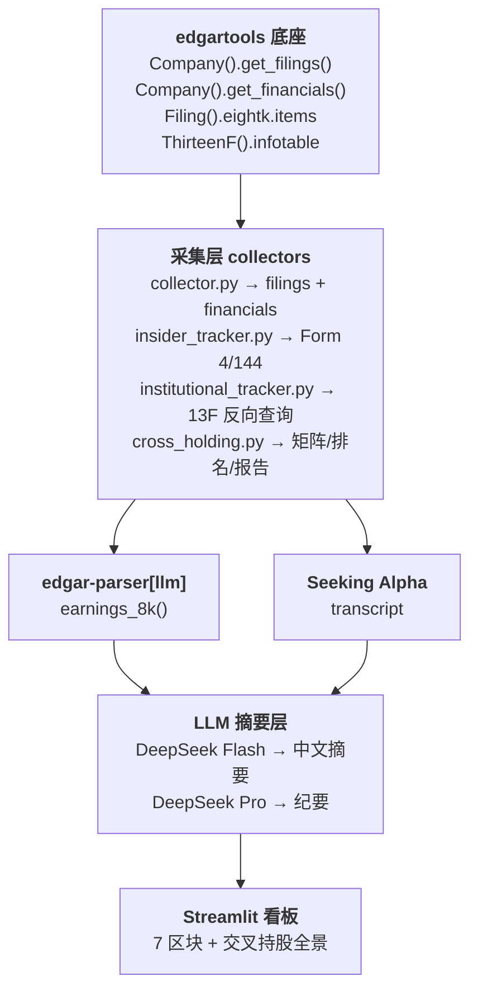

---
tags:
  - prd
  - mvp
  - 竞品监控
  - sec-edgar
date: 2026-06-24
status: review
phase: "代码层完成 ✅ | 数据准确性需修复 🔴 | 客户新需求待评审 📋"
critical_issues:
  - "B1: 13F value 字段单位混存（$ 与 $1000s）"
  - "B2: 报告显示金额放大 1000×"
  - "B3: 排名错乱（因 B1+B2）"
  - "B4: Vanguard 假清仓（Q1 2026 13F 未提交，被判清仓 $11.8B）"
  - "B5: BlackRock CIK 错误（应改为 0002012383）"
competitors:
  - CVNA
  - KMX
  - AN
  - LAD
  - PAG
  - GPI
  - SAH
  - ABG
  - CARG
  - CARS
  - TRUE
  - KAR
  - ACVA
  - RUSHA
  - UXIN
  - ATHM
  - VRM
audit_report: "prd/reference/audit-2026-06-19.md"
client_requirements: "prd/client-requirements-2026-06-23.md"
repair_plan: "docs/repair-plan-2026-06-19.md"
---

# 竞品情报监控系统 · PRD（Living Document）

> [!info] 文档状态
> **当前版本**: 2026-06-17（模块 F bug 修复完成，13F 数据已补 4 期）
> **状态**: Phase 1 ✅ / Phase 2 ✅ / 模块 F ✅（9/13 bug 已修复，见 §3.8）
> **文档策略**: 单活文档，所有过时版本（v1.0、v2.0-2.3、bug-fix-handoff）已合并至此文件，旧版归档至 [[prd/archive/]]

***

## 0. 前置决策：不造轮子

### 0.1 调研结论

> **`edgartools` 一个 Python 库已经覆盖了约 80% 的数据采集工作量。**
> MVP 的挑战不是"怎么从 SEC 拿数据"，而是"怎么把数据组织成老板看得懂的样子"。

### 0.2 造 vs 不造

| PRD 模块 | 不自建，直接用 | 需要自建 |
|----------|-------------|---------|
| **A. Filing 监控** | `Company("CVNA").get_filings().latest()` | — |
| **B. 财务数据提取** | `Company("CVNA").get_financials()` 一行拿全部标准化指标 | XBRL 标签中文命名映射（业务层） |
| **C. 8-K 事件预警** | `eightk.items` 返回结构化 Item 号<br>`edgar-parser[llm]` 自动调 LLM 提取 8-K 文本 | 事件分级规则<br>中文摘要生成 |
| **D. Earnings Call 纪要** | `edgar-parser[llm]`: `earnings_8k()` 提取 8-K 财报新闻稿 | Seeking Alpha transcript 抓取<br>中文纪要模板 |
| **E. Web 看板** | — | **全部自建**（Streamlit） |
| **F. 交叉持股分析** | `ThirteenF` 类解析 13F 持仓明细 | 反向查询逻辑、QoQ 对比、Churn Proxy、报告生成 |

### 0.3 选型决策

| 组件 | 选型 | 理由 |
|------|------|------|
| **SEC 数据底座** | [edgartools](https://github.com/dgunning/edgartools) (MIT, 3k+ ⭐) | 最成熟 SEC Python 库，覆盖 20+ form 类型、XBRL、13F |
| **8-K 文本 LLM 提取** | [edgar-parser](https://github.com/henrysouchien/edgar-parser) `[llm]` | 专门针对 8-K 做 LLM 提取 |
| **LLM** | DeepSeek v4 Flash（摘要）/ Pro（纪要） | 成本低、速度快 |
| **看板** | Streamlit | Python 原生，与 DataFrame 无缝衔接 |
| **存储** | SQLite | 轻量单文件 |
| **部署** | 本地 localhost | MVP 先本地演示 |

***

## 1. 产品概述

### 1.1 一句话

自动化监控 5 家美股二手车赛道竞品的 SEC 动向，生成中文 Web 看板。将人工 4-6 小时/次的分析工作压缩到 30 分钟内。

### 1.2 用户与场景

| 角色 | 需求 | 使用频率 |
|------|------|---------|
| **战略/战投负责人**（老板） | 快速了解竞品最新动态和财务对比，30 秒内获取关键信号 | 每周 1-2 次 |
| **分析师**（你） | 替代手工翻 SEC 网站的工作，自动获取标准化数据用于深度分析 | 季报季每日，平时每周 |

**场景 1：季报季监控**
5 家竞品扎堆发财报时，打开看板一眼看到全部关键指标——收入、利润、毛利率——自动对比，5 分钟读完 EC 纪要。

**场景 2：日常风险预警**
收到内部人减持、高管离职、机构清仓等信号时，看板标红提醒。

**场景 3：跨公司对比分析**
季度战略会前，选两家公司叠加 8 个季度的趋势图，2 秒出结论。

**场景 4：交叉持股分析（模块 F）**
追踪 Top 25 机构对竞品群的持仓全景：谁在买、谁在卖、谁新建仓、谁清仓、换手率高低。

### 1.3 MVP 范围

```
Phase 1（已完成 ✅）
  ✅ 5 家美股（CVNA/KMX/AN/UXIN/ATHM）
  ✅ SEC Filing 自动采集 + 中文摘要
  ✅ 标准化财务指标（12 个核心指标，季度 + 年度）
  ✅ 8-K 事件分级预警（中文）
  ✅ Earnings Call 纪要（8-K 财报新闻稿 + Seeking Alpha transcript）
  ✅ 单页 Streamlit 看板（6 区块）

Phase 2 ✅
  ✅ Form 4 内部人交易 — 采集 + 情绪指标
  ✅ Form 144 减持计划 — 采集 + 识别
  ✅ 13F 机构持仓 — 反向查询（25 家种子机构）+ 变动分析
  ✅ Dashboard "内部人与机构动向"看板区块

模块 F ✅
  ✅ 交叉持股矩阵 + QoQ 变动 + Top Buyers/Sellers + Init/Liq
  ✅ Turnover Proxy 估算 + 投资风格分类（3 类简化版）
  ✅ Markdown 报告（9 章，与 IHS Markit 格式对齐）
  ✅ Dashboard 交叉持股全景区块（7 Tab：热力图 + 排名表 + 饼图 + 柱状图）
  ✅ 差距分析文档（[[gap-analysis-ihs-markit]]）

后续阶段
  ❌ 港股、非上市公司 → Phase 3
  ❌ ASR 音频转写 → Phase 3
  ❌ 钉钉/飞书推送 → Phase 4
  ❌ PDF/PPT 报告导出 → Phase 4
```

### 1.4 17 家竞品（汽车零售生态对标组）

> [!note] 扩展日期: 2026-06-18
> 从原来的 5 家（推断）扩展到 17 家，覆盖二手车线上平台、经销商集团、线上信息平台、批发拍卖四个子赛道。

| # | 公司 | Ticker | CIK | 赛道 | Section 16 |
|---|------|--------|-----|------|-----------|
| 1 | Carvana | CVNA | 0001690820 | 线上二手车 | ✅ |
| 2 | CarMax | KMX | 0001170010 | 二手车零售商 | ✅ |
| 3 | AutoNation | AN | 0000350698 | 经销商集团 | ✅ |
| 4 | Lithia Motors | LAD | 0001023128 | 经销商集团 | ✅ |
| 5 | Penske Automotive | PAG | 0001019849 | 经销商集团 | ✅ |
| 6 | Group 1 Automotive | GPI | 0001031203 | 经销商集团 | ✅ |
| 7 | Sonic Automotive | SAH | 0001043509 | 经销商集团 | ✅ |
| 8 | Asbury Automotive | ABG | 0001144980 | 经销商集团 | ✅ |
| 9 | CarGurus | CARG | 0001494259 | 线上信息平台 | ✅ |
| 10 | Cars.com | CARS | 0001683606 | 线上信息平台 | ✅ |
| 11 | TrueCar | TRUE | 0001327318 | 线上定价平台 | ✅ |
| 12 | OPENLANE | KAR | 0001395942 | 批发拍卖 | ✅ |
| 13 | ACV Auctions | ACVA | 0001637873 | 批发拍卖 | ✅ |
| 14 | Rush Enterprises | RUSHA | 0001012019 | 商用车经销商 | ✅ |
| 15 | 优信 | UXIN | 0001729173 | 中国竞品 | ❌ ADR |
| 16 | 汽车之家 | ATHM | 0001527636 | 中国竞品 | ❌ ADR |
| 17 | Vroom | VRM | 0001580864 | 线上二手车(濒临退市) | ✅ |

> [!warning] CIK 修正记录（2026-06-18）
> 旧 config 中 25 家机构有 **12 家 CIK 映射错误**（如标为 "Geode Capital" 的 CIK 实际是 Citadel Advisors，标为 "T. Rowe Price" 的 CIK 实际是 Bridgewater）。已通过 SEC JSON API + 13F 申报双重验证，全部修正为正确的 CIK。详见 [[sec-cik-correction-2026-06-18]]。

***

## 2. 技术架构

### 2.1 数据流



### 2.2 文件清单

```
src/
├── config.py                ✅ 配置中心：竞品、机构、调度表
├── collector.py             ✅ 数据采集 + 财务提取
├── summarizer.py            ✅ LLM 摘要 + 纪要
├── dashboard.py             ✅ Streamlit 看板（7 区块，~1223 行）
├── scheduler.py             ✅ 定时调度
├── insider_tracker.py       ✅ Form 4/144 解析 + 情绪指标
├── institutional_tracker.py ✅ 13F 反向查询 + 机构信号（~367 行）
└── cross_holding.py         ✅ 交叉持股分析引擎（~1082 行）
```

### 2.3 数据库 Schema

12 张 SQLite 表，关键表如下：

**institutional_holdings** — 13F 持仓原始数据
```
UNIQUE(institution_cik, report_period, ticker)
```

**cross_holding_matrix** — 交叉持股矩阵（缓存表，每次 13F 采集后重建）
```sql
UNIQUE(institution_cik, report_period)
-- 列序(0-15): id, report_period, institution_name, institution_cik,
--   cvna_value_x1000, kmx_value_x1000, an_value_x1000,
--   uxin_value_x1000, athm_value_x1000,
--   total_value_x1000, total_change_x1000, peer_avg_x1000,
--   style_label, activism_level, turnover_proxy, created_at
```

**institution_styles** — 机构风格静态标签
```sql
PRIMARY KEY (institution_cik)
-- 25 家种子机构的 Index / Active / Broker 简化标签
```

***

## 3. 模块详解

### 3.1 config.py — 配置中心

核心常量已在线上生产环境，关键注意点：

- `EDGAR_IDENTITY` 必须设置为有效邮箱，否则 SEC 会 404
- `COMPETITORS` 中的 CIK 必须是 10 位 padded 格式
- `TOP_INSTITUTIONS` = 25 家种子机构（Vanguard、BlackRock、State Street 等）
- `ACTIVIST_INSTITUTIONS` = 8 家已知 activist（静态名单）
- `INSTITUTION_STYLES` = 25 家机构的简化风格标签（Index / Active / Broker）

### 3.2 collector.py — 数据采集

核心逻辑：edgartools 已处理 SEC API 限流、缓存、XBRL 标准化。collector 只做"什么时候存、存哪里"。

### 3.3 summarizer.py — LLM 摘要层

8-K 中文摘要 + EC 纪要生成，使用 DeepSeek Flash（速度优先）+ Pro（推理优先）。

### 3.4 dashboard.py — Streamlit 看板

7 个区块：
1. 概览条 — 5 家公司涨跌信号
2. Filing 时间线 — 最新 filing 列表
3. 财务对比折线图 — 指标下拉 + 5 公司叠图
4. 事件预警 — 分级列表
5. EC 纪要 — 展开式阅读
6. 内部人与机构动向 — Phase 2
7. 交叉持股全景（模块 F）— 7 Tab：Top Holders / QoQ / Activists / Buyers / Sellers / Init·Liq / Charts

### 3.5 scheduler.py — 定时任务

- collector: 每 6 小时
- summarizer: 每 30 分钟
- 13F: 季度（季末 + 50 天后触发）

### 3.6 insider_tracker.py — 内部人交易

- Form 4 XML 解析（edgartools `c.get_filings(form="4")` + 手动解析 XML）
- Form 144 文本解析（正则提取股数 + 金额）
- 情绪指标加权算法：`Sentiment = Σ(买入 × 角色权重) - Σ(卖出 × 角色权重)`

### 3.7 institutional_tracker.py — 13F 机构持仓

**核心流程**（含 BUG-2 修复后）:

1. 对 25 家种子机构逐一调用 `Company(inst_cik).get_filings(form="13F-HR").latest(4)` → 拉取最近 4 期
2. **遍历每期**（非仅最新期）→ `INSERT OR IGNORE` 写入 `institutional_holdings`
3. 机构间 `time.sleep(0.15)` 限流
4. 跨期对比计算 InstitutionalSignal

**已知数据状态**（2026-06-17 采集后）:

```
9 个 report_period: 2023-09-30 ~ 2026-03-31
8 家机构各有 4 期连续数据（2025-06-30 ~ 2026-03-31）
Vanguard: 4 期（2025-03-31 ~ 2025-12-31）
BlackRock: 4 期（2023-09-30 ~ 2024-06-30）
```

### 3.8 模块 F：交叉持股分析引擎

#### 目标

以 IHS Markit Cross Ownership Report 为交付模板，基于已采集的 13F 数据，生成一份可比（但不完全等价）的交叉持股分析报告，涵盖 5 家竞品。

#### 6 个分析维度（全部已实现）

| # | 维度 | 对应 IHS 页 | 实现位置 |
|---|------|-----------|---------|
| 1 | **Top Holders Positions**（持仓矩阵） | P2 | `build_cross_holding_matrix()` |
| 2 | **Top Holders QoQ Changes**（持仓变动） | P3 | `compute_qoq_changes()` |
| 3 | **Top Peer Buyers / Sellers**（增减持排名） | P5-P6 | `rank_top_buyers_sellers()` |
| 4 | **Initiations / Liquidations**（新建仓/清仓） | P7 | `find_initiations_liquidations()` |
| 5 | **Turnover Proxy**（换手率估算） | P10 | `compute_turnover_proxy()` |
| 6 | **Markdown 报告生成**（9 章） | P1-P11 | `generate_cross_holding_report()` |

#### 关键修复结论（13 个 Bug）

| # | 症状 | 根因 | 修复 |
|---|------|------|------|
| **BUG-2** 🔴 | 13F 只有最新一期 | `latest(2)` 拉 2 期但只用 `[0]` | 改为遍历所有期 + `latest(4)` |
| **BUG-1** 🔴 | `total_change` = 完整持仓额 | 缺 prior 期 → delta = current - 0 | 仅双期都存在时计算 |
| **BUG-3** 🔴 | Initiation=25（应该≈0） | prev 数据残缺，全部被当新建仓 | QoQ 过滤 prev-only 机构 |
| **BUG-5/6** 🔴 | Turnover 100% High | prev-only 机构参与计算 | 排除 curr 无持仓的机构 |
| **BUG-10** 🟡 | value=0 持仓污染分类 | SQL 没加 `HAVING > 0` | `_get_pairs` 加 HAVING |
| **BUG-8** 🟡 | Schema 列序不一致 | DB 与代码 CREATE TABLE 不匹配 | 删表重建，列序统一 |
| **BUG-9** 🟡 | Dashboard 重复 QoQ 逻辑 | 独立实现 vs 调用 cross_holding | 对齐逻辑 |
| **BUG-11** 🟡 | Vanguard 净流出计入被动 | prev-only 机构污染柱状图 | 过滤后自动解决 |
| **BUG-12** 🟡 | 无 SEC 限流 | 无 sleep | `time.sleep(0.15)` |
| **BUG-14** 🟡 | Tab 2 单位不可读 | $K + 1,789,747,106 = 不可读 | 改为 `$M` 格式化 |
| **BUG-15** 🟢 | 资本流向计算 2 次 | 重复开 DB 连接 | 提取 `_compute_flows_once()` |

#### Compute 逻辑关键细节

**QoQ Changes**:
```python
# 过滤：排除 prev-only 机构（无 curr 数据则 QoQ 无意义）
merged = merged[merged["value_x1000_curr"].notna() & (merged["value_x1000_curr"] > 0)]
```

**Turnover Proxy**:
```python
Churn = Σ|Δvalue_i| / Σ avg(value_i)  # 仅针对竞品 peer group
# 跳过 prev-only 机构
if (inst_data["current_value"] == 0).all():
    continue
```

**Initiation = prev 无/0 + curr > 0**，**Liquidation = curr 无/0 + prev > 0**，均加 `HAVING SUM(value_x1000) > 0`。

#### 已知限制

| 差距项 | IHS Markit | 我们 |
|--------|-----------|------|
| **机构覆盖** | ~5,000+ 家 | Top 25 |
| **风格分类** | 12 类（Value/Growth/GARP 等） | 3 类简化（Index/Active/Broker） |
| **Turnover** | 基于 12 个月日度交易数据 | QoQ 快照 churn proxy |
| **Activist 识别** | 13D 追踪数据库 | 静态名单 8 家 |

详细差距分析见 [[gap-analysis-ihs-markit]]。

### 3.9 中国竞品特殊处理

| Form 类型 | 美国竞品 | 中国竞品 |
|-----------|---------|---------|
| Form 4 | ✅ 正常 | ⚠️ 不期望有数据 |
| Form 144 | ✅ 正常 | ⚠️ 同上 |
| 13F | ✅ 正常 | ✅ 正常（机构申报不受 ADR 影响） |

Dashboard 对 UXIN/ATHM 显示"不适用"而非"无数据"。

***

## 4. 机构风格静态标签

### 4.1 投资风格（3 类简化）

| 标签 | 机构 | 共计 |
|------|------|------|
| **Index** | Vanguard, BlackRock, State Street, Geode, Northern Trust, Legal & General | 6 |
| **Broker** | Goldman Sachs, Morgan Stanley | 2 |
| **Active** | 其余 17 家 | 17 |

### 4.2 激进投资者名单（8 家已知 activist）

- **often**: Citadel, Two Sigma, Wellington
- **occasional**: Fidelity, T. Rowe Price, Baillie Gifford, Renaissance, LSV

***

## 5. 验收标准

| # | 条件 | 状态 |
|---|------|------|
| 1 | 5 家公司新 filing 自动采集无遗漏 | ✅ |
| 2 | 12 个核心财务指标准确率 > 99% | ✅ |
| 3 | 8-K Item 2.02/5.02 零漏报 | ✅ |
| 4 | 中文摘要可被非财务同事读懂 | ✅ |
| 5 | EC 纪要 5 分钟内可读完 | ✅ |
| 6 | 看板加载 < 3 秒 | ✅ |
| 7 | Form 4/144 内部人交易自动采集 | ✅ |
| 8 | 内部人情绪指标正确反映方向 | ✅ |
| 9 | 13F 机构持仓变动识别正确 | ✅ 抽样可用 |
| 10 | 中国竞品不报错 | ✅ |
| 11 | 交叉持股矩阵正确展示 5×N 持仓 | ✅ |
| 12 | Top Buyers/Sellers 排名逻辑正确 | ✅ verified |
| 13 | Initiations/Liquidations 无遗漏 | ✅ verified |
| 14 | 报告和看板包含免责声明 | ✅ 9 处 |
| 15 | Dashboard 有独立的 Activists Tab (P4) | ✅ |
| 16 | Dashboard 有饼图 + 柱状图 (P8-P10) | ✅ |
| 17 | 排名表含 Style/Turnover/Change 列 | ✅ |
| 18 | Markdown 报告每节有 Commentary | ✅ |

***

## 6. 后续路线图

| 阶段 | 内容 | 预计工时 |
|------|------|---------|
| **当前** | ✅ 模块 F + CIK 修正 + 竞品扩展（5→17） + Markdown 报告升级 | ✅ |
| **N+1** | **6 家缺失机构 CIK** — 补全 Baillie Gifford / Geode / Nuveen / AllianceBernstein / LSV / Legal & General 的 13F 申报 CIK | 4 小时 |
| **N+2** | **机构覆盖扩展** — 种子池 25→100+ | 1 周 |
| **N+3** | **功能扩展** — PDF 报告导出、交叉持股自动周报 | 1 周 |

> [!tip] 建议优先级
> 先排查 FMR CIK 问题（可能已变更 CIK），然后运行 collector 补齐 25 家 4 期数据，再向甲方演示。

***

## 7. 风险与已知坑位

| 风险 | 缓解 |
|------|------|
| **edgartools API 兼容性** | 先用 Carvana 一家验证，再扩展到 5 家 |
| **优信/汽车之家 XBRL 标签** | 中概股可能用 IFRS 标签，需单独验证 |
| **Seeking Alpha 反爬** | 生态辅助源，失败不影响核心 |
| **13F 滞后 45 天放大** | 报告标注"截止 {report_period}，非实时持仓" |
| **交叉持股只 25 家机构** | 始终标注覆盖范围限制 |
| **FMR CIK 0000938836 返回 404** | 该 CIK 可能在 SEC 系统中已更新，需人工确认 |
| **投资风格无法自动化** | 3 类简化标签非 IHS 等价，加免责声明 |

***

## 附录 A：为什么 edgartools

| 候选 | 结论 |
|------|------|
| **edgartools** | ✅ **选它** |
| edgar-parser 单独用 | 覆盖范围窄 |
| sec-edgar-toolkit | 社区小，缺 MCP |
| Quartr/Aiera/AlphaSense | 企业定价，英文产品 |
| 完全自建 | 4-6h vs 2-3 天 |

## 附录 B：关键参考

- [edgartools GitHub](https://github.com/dgunning/edgartools)
- [edgartools 文档](https://edgartools.readthedocs.io/)
- [edgar-parser GitHub](https://github.com/henrysouchien/edgar-parser)
- SEC API 技术验证代码: `utils/sec_api_cheatsheet.py`
- 甲方期望报告: [[RLX Q3'21 Cross Ownership Report]]
- 差距分析: [[gap-analysis-ihs-markit]]
- 技术栈全景对比: [[technology-stack-landscape]]

## 附录 C：文档历史

| 文档 | 时间 | 去留 |
|------|------|------|
| `v1.0-selfbuilt.md` | 2026-06-16 | 📦 归档至 `prd/archive/` |
| `v2.0-edgartools.md` | 2026-06-17 | 📦 归档至 `prd/archive/` |
| `cross-holding-bug-fix-handoff-2026-06-17.md` | 2026-06-17 | 📦 归档至 `prd/archive/` |
| **`PRD.md`**（本文件） | 今 | ✅ 当前活的 PRD |
| `reference/gap-analysis-ihs-markit.md` | 2026-06-17 | ✅ 保留为独立参考 |
